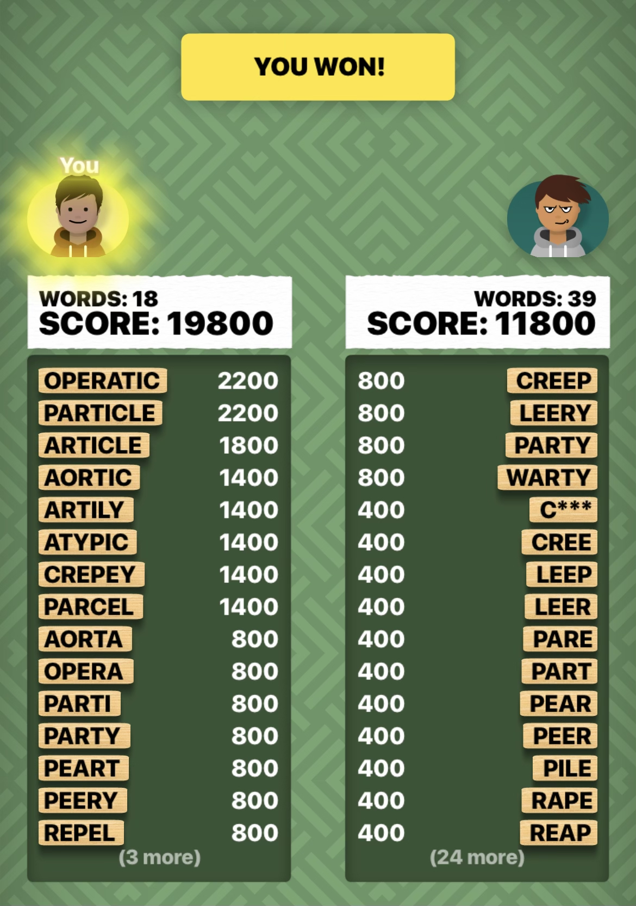
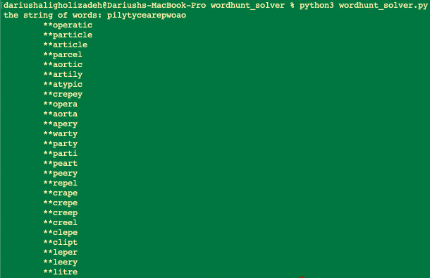

# wordhunt-solver

## Instructions
1. make sure to download the wordhunt_solver.py and the dictionary folder (keep path structure the same)
2. go into the folder level where wordhunt_solver is directly accessible and run "python3 wordhunt_solver.py"
3. when prompted for the grid, input the 4x4 as a single string with no spaces reading left to right up to down, so for example
A A A A 
A A A A
A A A A   --> AAAAAAAAAAAAAAA
A A A A
4. the solutions are output from longest to shortest

